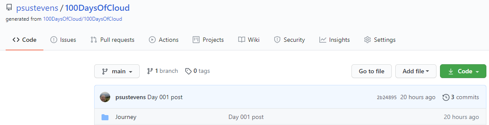
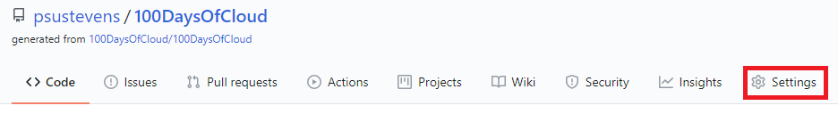
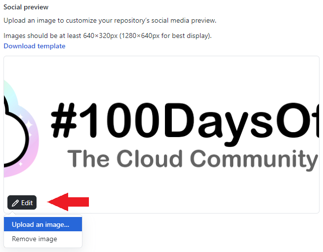

# Github Customization #1

## Introduction

I stumbled upon a web page that tells you how to customize your Github repo when sharing it over social media.  So, I decided to give that a whirl.

## Use Case

You're probably wondering what this has to do with the cloud.  Frankly, it has nothing to do with the cloud.  But, I figured while I'm learning more about Github why not learn how to customize it.  This way when I share my updates on [Twitter](https://twitter.com/psustevens) it has a nice image assigned to it.

## Prerequisite

Obviously, you need to have the following:

1. A Github account
2. At least one repository you want to customize
3. For this exercise you will need a .jpg or .png file at least 640x320px or (1280x640px preferably).  It's best to keep the file size under 1 MB.

## How to Steps

I will document the steps below to do this using my personal account.  But, if you want to follow the official Github instructions you can find them over [here:](https://docs.github.com/en/free-pro-team@latest/github/administering-a-repository/customizing-your-repositorys-social-media-preview)

### Step 1

Login to your Github account and navigate to the repository you want to customize.

### Step 2

Under the name of your repository you will see a **Settings** link.  Click it.

### Step 3

Look for the *Social Preview* section.

Click the **Edit** button.
 - Click **Upload an Image...** to upload a new image or change the existing image. You will see I already uploaded the 100DaysOfCloud banner.
 - Click **Remove image** to, obviously, remove the image.

## Next Steps

Next, I'll write about what I do to commit changes to my Github repository and push the changes to it.

## Social Proof

[Twitter post showing the social image](https://twitter.com/PSUStevens/status/1310373427585470466?s=20)
